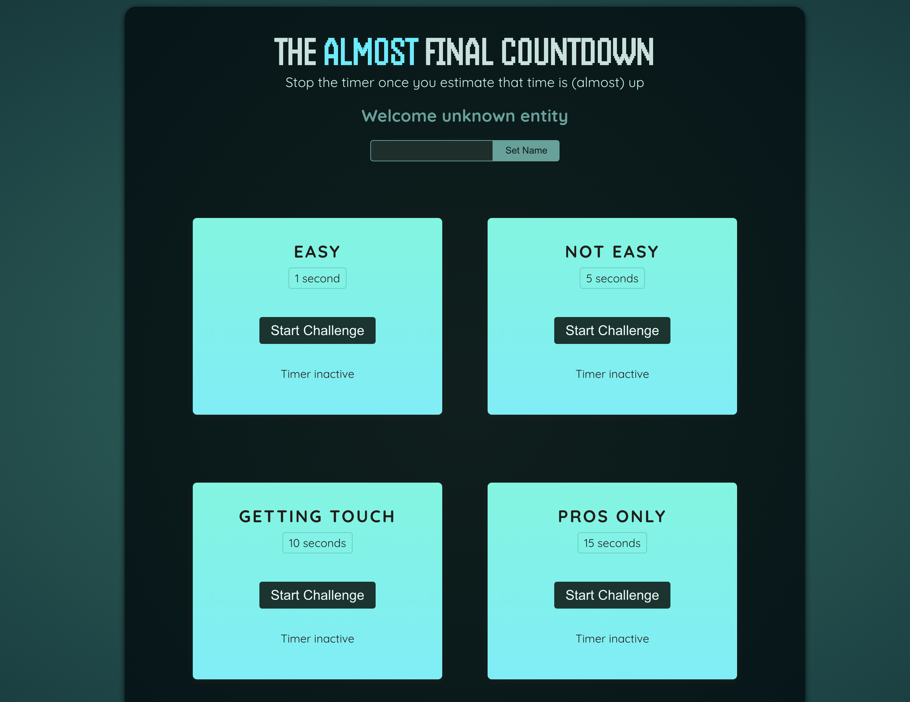

# React - Basic Timer Game

A basic Timer Game that is built to learn the concepts of _**useRef**_, _**forwardRef**_, _**useImperativeHandle**_ and _**createPortal**_ functionalities.

1. `npm install`
2. `npm run dev`

$~$

$~$
Sample Images of Website

